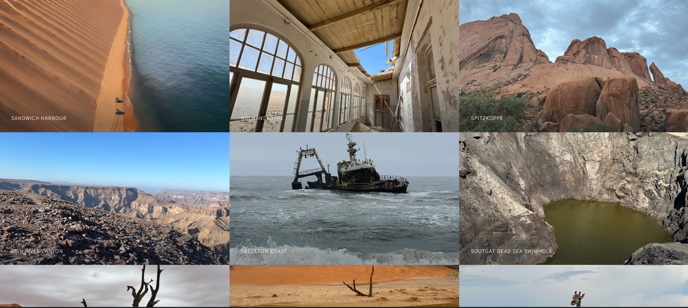
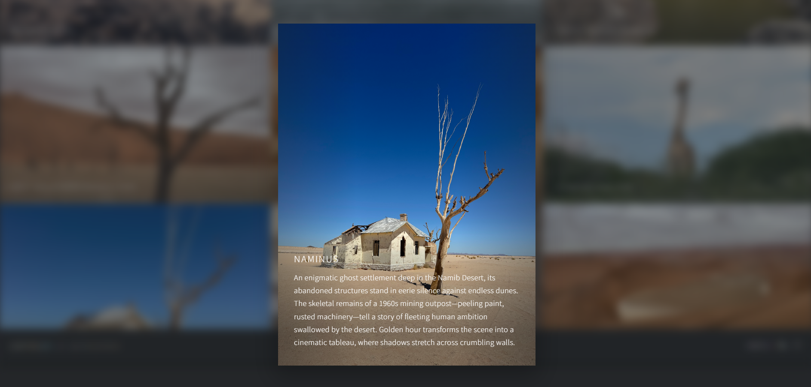

## 🌍 Travel With Dennisrmnk

 

## 📷 About the Content
All photographs featured in this project were captured by me during my travels across Namibia.  
The project combines development skills with authentic travel storytelling.

**Responsive travel photography website** showcasing original photos and stories from my journey through **Namibia**.

Built to demonstrate clean front-end structure, interactive UI behaviour, and real-world content presentation.

---

## 🛠 Tech Stack
- HTML5
- CSS3
- JavaScript (ES6)
- **jQuery**
- jQuery Poptrox (image gallery/lightbox)

---

## ⚡ At a Glance
- I took all the photos displayed during my travels in Namibia
- Interactive image gallery with lightbox previews
- Fully responsive layout (desktop, tablet, mobile)
- jQuery-powered UI interactions

---

## 🎯 Purpose of the Project
This project demonstrates my ability to:
- Build polished, user-facing interfaces
- Implement interactive UI using JavaScript and jQuery
- Work with third-party libraries
- Combine real-world content with clean front-end architecture
- Deliver a complete, production-ready static website

---

## ⚙️ How to Run Locally

1. Clone the repository  
   ```bash
   git clone https://github.com/FrontEndHighRoller/trip-namibia-photos.git
2. Open index.html in your browser
3. Resize the screen to see responsive layouts and image switching in action 🎯

---

🙋‍♂️ Author
Dennis Rumanek

GitHub: https://github.com/FrontEndHighRoller

LinkedIn: https://www.linkedin.com/in/dennis-rumanek/

⭐ If you like this solution, feel free to star the repository!


